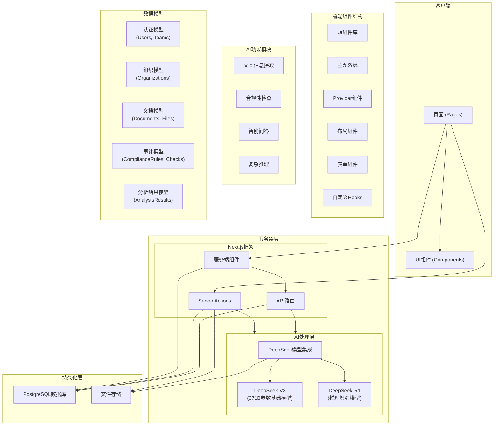

# 智审大师系统架构

## 系统架构图

## 架构说明

### 1. 客户端层

客户端层采用Next.js框架的客户端组件，负责用户界面渲染和交互。

- **页面 (Pages)**: 遵循Next.js的应用路由结构，包含核心页面、登录页面和管理页面
- **UI组件 (Components)**: 包含可复用的UI组件，如按钮、表单、导航栏等

### 2. 服务器层

服务器层包含Next.js框架的服务端能力和AI处理模块。

- **Next.js框架**:
  - **服务端组件**: 负责数据预取和服务端渲染
  - **Server Actions**: 处理表单提交和数据修改等操作
  - **API路由**: 提供客户端API接口

- **AI处理层**:
  - **DeepSeek-V3**: 基础大模型，用于文本理解和生成
  - **DeepSeek-R1**: 推理增强模型，用于复杂审计任务和信息提取

### 3. 持久化层

持久化层负责数据的存储和检索。

- **PostgreSQL数据库**: 存储用户数据、组织信息、文档元数据和审计结果
- **文件存储**: 存储上传的文档文件

### 4. 主要功能模块

- **文本信息提取**: 从会议纪要和合同中提取关键信息
- **合规性检查**: 根据规则检查文档的合规性
- **智能问答**: 基于文档内容回答问题
- **复杂推理**: 进行决策分析和逻辑推理

### 5. 数据流

1. 用户通过客户端上传文档或发起请求
2. 请求通过Server Actions或API路由传递到服务器
3. 服务器根据请求类型调用相应的AI处理模块
4. AI模块处理请求并返回结果
5. 结果存储到数据库并返回给客户端
